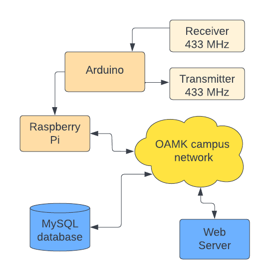

# Telecoms Application Project - Autumn 2022

#### **ENG**

 This repository is a part of Oulu University of Applied Sciences' _Telecoms application project_ course. The purpose of the project is to apply previously learned fundamentals of telecoms, IoT and machine learning.

### **The Project**

> There is an IoT-router (Raspberry Pi) in the telecoms lab, which is connected to the OAMK campus network. The student's task is to code an Arduino client that measures accelerometer data, and transfers it wirelessly to the IoT router according to provided specifications. The IoT router is provided fully operational, and stores received data in a MySQL database.
>
> The data stored in the database is accessible through TCP socket interface and HTTP API. Collected data is fetched to a laptop using a program made by the student, and used to train a machine learning model.

 

####  **FIN**

Tämä repositorio on osa Oulun Ammattikorkeakoulun _Tietoliikenteen sovellusprojekti_ -kurssia. Projektissa sovelletaan aiemmin opittuja tietoliikenteen, IoT:n ja koneoppimisen perusteita.

### **Projekti**

> Tietoliikennelabrassa on IoT-reititin (Raspberry Pi), joka on Oamkin kampusverkossa. Opiskelijoiden tehtävänä on koodata Arduinolle client, joka mittaa kiihtyvyysanturin dataa ja välittää tietoa langattomasti IoT-reitittimelle valmiiksi annetun speksin mukaisesti. IoT-reititin on asennettu valmiiksi ja varastoi vastaanotettua dataa MySQL-tietokantaan.
>
>Tietokantaan tallentuvaan dataan on TCP-sokettirajapinta ja HTTP API. Kerättyä dataa haetaan rajanpinnasta omaan kannettavaan koodatulla ohjelmalla ja käsitellään koneoppimistarkoitukseen.

