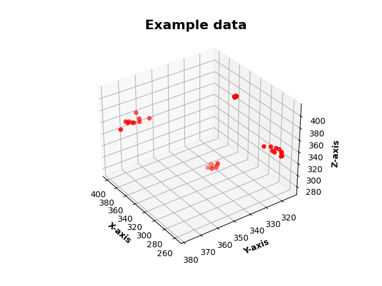
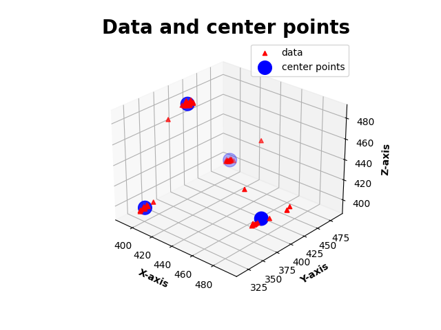

# Telecoms Application Project - Autumn 2022

_Oulu University of Applied Sciences
 
Course: Telecoms Application Project | IN00CS94-3002 (15 credits)
 
Part: Application Project (11 credits)_
 
 
**Project author:**
 
_Olli Juntunen
 
TVT21SPL
 
Oulu University of Applied Sciences, Information Technology, Option of Device and Product Design_
 
 

## **The Project**

(See the [poster](./etc/olli_juntunen_telecoms_application_project_poster.pdf) for a brief overview.)
 
 

The allotted time for the project is 8 weeks. The project is done as solo work, but students coordinate their progress among study groups in daily meetings, and a weekly review is held with the supervising teacher(s).

 

### **Brief description of the project**
The goal of the project is to create an Arduino application that transmits acceleration data (measured with the accelerometer pointing in different directions) wirelessly to a receiving device (provided by the teaching staff), which enters the data into a database. The data, accessed by the student through various APIs, is  then used to teach a K-means clustering algorithm. The resulting  model is imported back to the Arduino where it’s used to predict the alignment of the accelerometer in real time.
 

The project work also includes material and tasks related to the following subjects:
- Linux fundamentals
- Server management
- APIs
- Infrastructure as Code 
- Software Licenses

### **Week by week schedule of tasks**
Week 1:
- Setting up the repository
- Getting familiar with agile software development and scrum
- Getting started with Linux

    Extra:
    - Learning basics Linux commands

Week 2:
- Arduino code to make measurements with Accelerometer
- Wireless transceiver functionality of the Arduino
- Wiring up all the necessary components

Week 3:
- Learning about firewall scripts
- Running an Apache server on Linux
- Displaying content on the server using scripts
- Server traffic analysis with Wireshark
- Coding a TCP client program in Python to fetch a CSV file
- Coding a Python script that makes an SQL query to the database and saves the results in a CSV file.

    Extra:
    - More Linux commands
    - File compression
    - More server management tasks
    - Learning about GNU
    - Learning about C/C++ compilation

Week 4:
- Learning about software licenses
- Various API related tasks
- Coding a Python Socket Client to get data from database server

Week 5:
- Coding a K-means algorithm in Python to identify clusters in accelerometer data.

Week 6:
- Importing the results of the Python algorithm to the Arduino and using them to implement an algorithm on the Arduino to predict the alignment of the accelerometer in real time.

Week 7:
- Making a project poster
- Finalizing the readme document
- Finishing any unfinished work from earlier weeks

Week 8:
- Finishing any unfinished work

 

## **The Main Parts of the Project In-Depth**

### Week 2 - Wireless Transceiver with the Arduino

For this part of the project a 433 MHz [transmitter](https://cdn.sparkfun.com/datasheets/Wireless/General/TWS-BS-3_433.92MHz_ASK_RF_Transmitter_Module_Data_Sheet.pdf) and [receiver](https://cdn.sparkfun.com/datasheets/Wireless/General/RWS-371-6_433.92MHz_ASK_RF_Receiver_Module_Data_Sheet.pdf), as well as the [RadioHead](https://www.airspayce.com/mikem/arduino/RadioHead/) library were used. The resulting transceiver was duplex, and used ASK for signal modulation. The transmission were received by a Raspberry Pi connected to the campus network (see figure 1), which upon receiving a valid message sent back an acknowledgement and entered the data into the database.

 
_Figure 1: data architecture diagram_

The code consisted of the [Accelerator-class](./arduino_main/accelerator.h), the [Messaging-class](./arduino_main/messaging.h), and the [main program](./arduino_main/arduino_main.ino). The Accelerator-class was rather a trivial task, but the Messaging-class and the main program required a deep dive into the RadioHead source code, which I'd luckily done before starting work on this part. Surprisingly, I found it relatively easy to understand, which I believe speaks to both the quality of the documentation, and the improvement of my programming skills.

### Week 5 - K-means clustering algorithm

By far the most difficult part of the project. I'm generally quite good at visualizing program structures in my head, but this one forced me to pull out pen and paper (which I really should make a habit of) to figure out what I need to do and what steps need to happen to get there. Here's the general idea:

We've measured acceleration data with the accelerometer in K (in my case four) different positions. In figure 2 you can see four clusters of data. Each of these clusters corresponds to making measurements with the accelerometer pointed a different way. Our end goal is to predict which way the accelerometer is pointing, by figuring out which cluster the new measurement belongs to, i.e. which cluster is closest to it.

 
_Figure 2: example dataset with four data clusters_

So we need to find the center points of the clusters, and here is where the algorithm comes in:

1. Our four center points start with random xyz-coordinates in the valid range (in this case, 0-1023), each corresponding to a cluster.
2. We calculate the distance of each data point to the center points, and assign them to the closest cluster (the winning cluster)
3. After we've gone through all data points, we calculate new center points for all the clusters that won at least one data point. The remaining clusters are given a new random center point.
4. We repeat from step 1 until we meet a break condition.

If all goes as intended, the result should look something like figure 3 below. In this figure we have some real data, which is somewhat more erratic than the example dataset, but the algorithm still managed to locate the center points of the data clusters.

 
_Figure 3: the input data and the results of the algorithm_

All that's left after that, is to write these points into an [h-file](./arduino_main/centerpoints.h) and to write code to calculate the distance of any new measured 'point' to these four points, and to pick the one that's closest.

### **Conclusions**

This project is the most successful of the three I've done so far since starting my studies at Oulu University of Applied Sciences, both in terms of the quality of the end results, and the knowledge gained during the project.

The project was a lot of fun. Though machine learning isn't exactly a passion of mine, I ended up tinkering with the algorithms quite a bit to try to make it more efficient and more reliable, although I didn't manage to make it 100% reliable. But as far as programming goes, I certainly got a lot of practice and learned plenty of new things during this project.

The Linux side, although not really integral to the project itself, was also a lot of fun. The prevalence of C in Linux, as well as the ease of use from a programmer's perspective, has definitely piqued my curiosity. I will certainly be diving deeper into the world of Linux in my spare time.